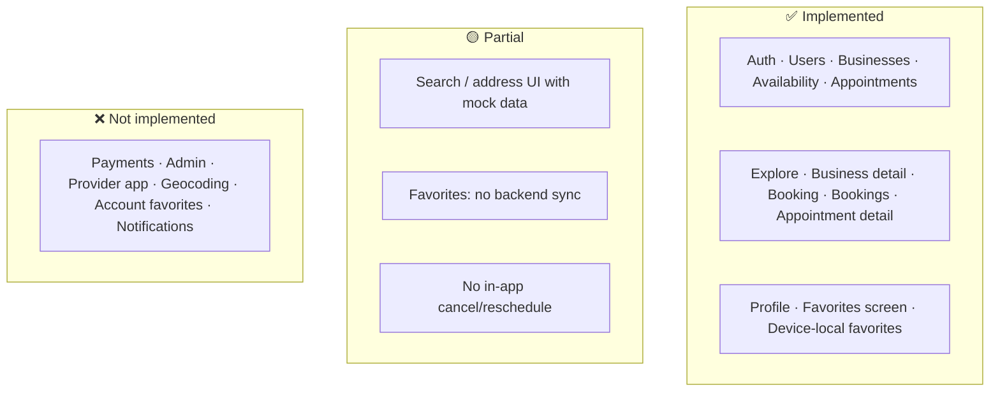
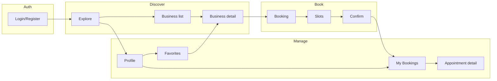

# Implementation Summary

**What the app has today vs what is left.** Use this for onboarding and to avoid assuming features that are not built yet.

---

## At a glance

| Status | Scope | Meaning |
|--------|--------|--------|
| **Implemented** | Core product | Shipped and working end-to-end: auth, explore, business detail, booking, bookings (+ detail), profile, favorites (device-local), API as below. |
| **Partial** | Search, address, favorites scope | Partially working: UI or backend exists but uses mocks or limited (e.g. address mock, no “Around Me”; favorites not account-level). |
| **Not implemented** | Roadmap | Not built: payments, admin, provider app, real geocoding, account favorites, push/notifications, etc. |

---

## 1. Implemented features (detailed)

### 1.1 Backend API (NestJS, prefix `/v1`)

All endpoints below are implemented and used by the mobile app unless noted.

| Module | Method | Endpoint | Auth | Description |
|--------|--------|----------|------|-------------|
| **Auth** | POST | `/auth/register` | No | Register; creates **client** only (no role in body). |
| | POST | `/auth/login` | No | Login; returns access + refresh tokens. |
| | POST | `/auth/refresh` | No | Refresh access token (body: refreshToken). |
| | GET | `/auth/me` | JWT | Current user from token. |
| **Users** | GET | `/users/me` | JWT | Current user profile. |
| **Businesses** | GET | `/businesses` | No | List businesses (paginated; optional `city`, `query`, `page`, `limit`). |
| | GET | `/businesses/:id` | No | Business detail (active only); includes locations (with `address`), services, staff, review count. |
| | GET | `/businesses/:id/services` | No | Services for a business. |
| | GET | `/businesses/:id/staff` | No | Staff for a business. |
| | POST | `/businesses` | JWT (provider/admin) | Create business + provider profile (transactional). |
| **Availability** | GET | `/businesses/:businessId/availability` | No | Slots for a date; query `serviceVariantId`, `date`, optional `staffId`. |
| **Appointments** | POST | `/appointments` | JWT | Create appointment (validates business/location/variants; overlap prevented). |
| | GET | `/appointments/me` | JWT | My appointments (query `upcoming=true|false`). |
| | GET | `/appointments/:id` | JWT | Appointment detail (ownership-aware; returns `location.address`). |
| | POST | `/appointments/:id/cancel` | JWT | Cancel (ownership/business-scoped). |
| **Services** | GET | `/services/businesses/:businessId` | No | Services by business. |
| | POST | `/services/provider` | JWT (provider/admin) | Create service. |
| | POST | `/services/provider/variants` | JWT (provider/admin) | Create service variant. |

**Backend behaviour (implemented):**

- Env validation at startup (required: `DATABASE_URL`, `JWT_ACCESS_SECRET`, `JWT_REFRESH_SECRET`, `PORT`, `ALLOWED_ORIGINS`).
- Argon2 password hashing; JWT access + refresh; rate limiting; DTO validation.
- Registration never assigns privileged roles.
- Appointment read/cancel are tenant-safe; booking create rejects cross-tenant IDs; overlap prevented at DB level (constraint).
- Swagger at `/api` when API is running.

---

### 1.2 Mobile app (Expo, Expo Router)

**Tabs and main screens:**

| Screen | Route | Implemented behaviour |
|--------|--------|------------------------|
| **Explore** | `(tabs)/explore` | Header with profile; “Find and book” CTA; **live** business list from `GET /businesses`; “Browse businesses” with cards; quick links (Search, Bookings, Provider login). |
| **Bookings** | `(tabs)/bookings` | “My bookings”; **live** list from `GET /appointments/me?upcoming=true`; status badges (BOOKED, CANCELLED, COMPLETED, NO_SHOW); pull-to-refresh; **tap card → appointment detail**. |
| **Appointment detail** | `(tabs)/bookings/[id]` | **Live** `GET /appointments/:id`; shows status, business, staff, date, time, address (if present). |
| **Profile** | `(tabs)/profile` | Name, email, role; **Favorites** link → Favorites screen; **My bookings** link → Bookings tab; Sign out. |
| **Favorites** | `(tabs)/favorites` | List of **device-local** favorites (IDs); fetches each business name from API; tap → business detail. |
| **Booking** | `(tabs)/booking` | Params: `businessId`, `serviceVariantId`; **single** business fetch; date picker (next 14 days); **live** slots from `GET /businesses/:id/availability`; create appointment → redirect to Bookings. |
| **Business detail** | `(tabs)/business/[id]` | **Live** `GET /businesses/:id`; image placeholder; category, address (from API `location.address`), rating; tabs: Services, About, Reviews (“Individual reviews coming soon”); tap service variant → Booking tab. |

**Auth (implemented):**

| Flow | Behaviour |
|------|-----------|
| Login | Email + password → tokens stored (SecureStore); redirect to tabs. |
| Register | Email, name, password → client account; then login. |
| Logout | Clears tokens and user state. |
| Auth guard | Unauthenticated users hitting booking/bookings are sent to login. |
| Dev bypass | `EXPO_PUBLIC_BYPASS_AUTH=true` only when `__DEV__`; not possible in production. |

**Navigation (implemented):**

- Explore → Profile or Login; Explore → Search; Explore → Business detail; Explore → Bookings.
- Business detail → Booking (with `businessId`, `serviceVariantId`).
- Bookings → Appointment detail (tap card).
- Profile → Favorites; Profile → My bookings.
- Favorites → Business detail.
- Legacy routes `/booking`, `/profile` redirect to `(tabs)/booking` and `(tabs)/profile`.

---

### 1.3 Shared packages

| Package | Implemented |
|---------|-------------|
| **shared** | Types (roles, statuses); `getNextDays`, `getDatePickerDayLabel`, `formatDate`, etc.; `buildCreateAppointmentPayload`, `generateIdempotencyKey`; appointment status labels. |
| **ui** | Design tokens (colors, spacing, typography, radius, shadows); `Text`, `Button`, `Card`, etc. |

---

### 1.4 Data and security (implemented)

| Area | Status |
|------|--------|
| Passwords | Argon2; never stored plain. |
| Roles | Public register → client only; provider/admin via privileged flow only (documented). |
| Appointments | Read/cancel by owner or admin; create validates business/location/variants; overlap blocked in DB. |
| Env | Validated at API startup; `.env` gitignored; examples only in docs. |

---

## 2. Partial / in progress

Features that exist but are incomplete (mocks, no backend, or limited scope).

| Feature | What works | What’s missing / limited |
|---------|------------|---------------------------|
| **Search (global)** | Entry from Explore → `/search`; SearchResults can use live businesses; address screen exists. | Search flow is legacy; canonical discovery is Explore + Business detail. |
| **Address search** | AddressScreen: text search with suggestions; selection stored in hook (`selectedAddress`, `onSelect`). | Suggestions use **mock data** (`MOCK_ADDRESSES`); no real geocoding. “Around Me” **removed** until expo-location. |
| **Favorites** | Favorites screen; toggle on business detail; list by ID with names from API; device-local storage (SecureStore). | **No** backend sync; **no** account-level favorites. |
| **Bookings (client)** | List, status, detail, create. | In-app **cancel** and **reschedule** not implemented (user would need to contact business or use API directly). |

---

## 3. Not implemented (planned / backlog)

| Category | Items |
|----------|--------|
| **Infra** | Redis/BullMQ for caching and background jobs. |
| **Backend** | Provider/admin onboarding API; refresh-token revocation/rotation store; webhook or job for reminders. |
| **Mobile** | Real geocoding or backend address API; “Around Me” (expo-location); account-level favorites + sync; push/email notifications; in-app cancel/reschedule UI. |
| **Product** | Admin dashboard (e.g. Next.js); dedicated provider app; Stripe; reviews (backend + UI); multi-location flows; advanced filters. |
| **Quality** | Mobile integration tests (login, business→booking, bookings list) — deferred; see `docs/audit/07-closed-decisions.md`. |

---

## 4. User journey (high level)

---

## 5. Quick reference

### Key files

| Area | Path |
|------|------|
| API entry | `apps/api/src/main.ts` |
| Env validation | `apps/api/src/env.validation.ts` |
| Auth | `apps/api/src/auth/` |
| Appointments | `apps/api/src/appointments/` |
| Businesses | `apps/api/src/businesses/` |
| Availability | `apps/api/src/availability/` |
| Mobile entry | `apps/mobile/app/_layout.tsx` |
| Tabs layout | `apps/mobile/app/(tabs)/_layout.tsx` |
| Explore | `apps/mobile/src/features/explore/pages/ExploreScreen.tsx` |
| Booking | `apps/mobile/src/features/booking/` (hook: `hooks/useBookingData.ts`) |
| Bookings | `apps/mobile/src/features/bookings/` |
| Favorites | `apps/mobile/src/features/favorites/` + `application/providers/favorites/` |
| Business detail | `apps/mobile/src/features/business/pages/BusinessDetailScreen.tsx` |
| Shared types | `packages/shared/src/types/` |
| API client | `apps/mobile/src/shared/lib/api.ts` (or under `src/`) |

### Run the project

| Step | Command |
|------|--------|
| Setup | See [QUICK_START.md](QUICK_START.md). Copy `apps/api/.env.example` → `apps/api/.env`; set `DATABASE_URL`, `JWT_ACCESS_SECRET`, `JWT_REFRESH_SECRET`. |
| DB | `cd apps/api && pnpm prisma:generate && pnpm prisma:migrate && pnpm prisma:seed` |
| API | `cd apps/api && pnpm start:dev` → http://localhost:3000/v1, Swagger http://localhost:3000/api |
| Mobile | `cd apps/mobile && pnpm start` (Expo); set `EXPO_PUBLIC_API_URL` if needed. |
| Both | From repo root: `pnpm dev` (runs API + mobile in parallel). |

---

## 6. Related docs

| Doc | Content |
|-----|---------|
| **README.md** | Project overview and structure. |
| **QUICK_START.md** | Step-by-step setup. |
| **SETUP.md**, **SUPABASE_SETUP.md** | Env and database. |
| **docs/ARCHITECTURE.md** | Architecture; what is current vs future. |
| **docs/audit/04-engineering-review.md** | Full remediation checklist. |
| **docs/audit/06-remediation-status-report.md** | Audit status (all items closed). |
| **docs/audit/07-closed-decisions.md** | Decisions (provider onboarding, refresh token, Around Me, etc.). |
| **apps/mobile/src/features/search/README.md** | Search feature; mock vs live; file classification. |
