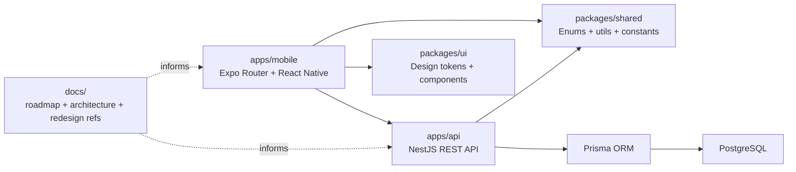

# Repository Exploration

## Executive Summary

This repository is a `pnpm` + `Nx` monorepo centered on two active applications:

- `apps/mobile`: an Expo React Native client built with Expo Router
- `apps/api`: a NestJS REST API backed by Prisma and PostgreSQL

Shared code lives in `packages/shared` and `packages/ui`. The product direction is broader than the current implementation: root docs mention Redis/BullMQ, S3-style storage, GDPR tooling, and a future `admin-web`, but the active first-party code is currently a mobile app plus a single backend service.

## Workspace Map

| Path | Role | Key Notes |
| --- | --- | --- |
| `apps/mobile` | Customer-facing mobile app | Expo Router app, feature-first UI code, auth/favorites providers |
| `apps/api` | Backend API | NestJS modules for auth, users, businesses, services, availability, appointments |
| `packages/shared` | Cross-app domain primitives | roles, statuses, date helpers, validation, constants |
| `packages/ui` | Shared design system | tokens and React Native UI components |
| `packages/config` | Shared tooling config | base TypeScript and ESLint config |
| `docs` | Product/reference/design docs | architecture notes, roadmap, redesign references, local skills |
| `.cursor/skills` | Contributor workflow helpers | non-runtime project skills and wrappers |

## Main Folders And Core Modules

### `apps/mobile`

Mobile routing is defined under `apps/mobile/app`, with global setup in `app/_layout.tsx` and the main authenticated area in `app/(tabs)/_layout.tsx`. Product code is mostly feature-oriented under `apps/mobile/src/features`.

Primary mobile areas:

- `src/application/providers`
  Global providers for auth, favorites, fonts, splash behavior, and safe-area setup.
- `src/features/auth`
  Login and registration screens.
- `src/features/explore`
  High-level entry point into discovery.
- `src/features/business`
  Real business detail screen and booking handoff.
- `src/features/booking`
  Real API-backed booking flow.
- `src/features/bookings`
  My Bookings screen.
- `src/features/profile`
  Read-only profile and logout.
- `src/features/search`
  Older, richer but mostly mock-driven search/discovery flow that still coexists with the newer live flow.
- `src/shared/lib`
  Axios API client and auth helpers.

### `apps/api`

The backend boots from `apps/api/src/main.ts` and composes modules through `apps/api/src/app.module.ts`.

Primary backend modules:

- `src/auth`
  Registration, login, refresh, JWT strategy/guard, current-user endpoint.
- `src/users`
  Current profile access.
- `src/businesses`
  Business list/detail/create flows, plus service/staff accessors.
- `src/services`
  Provider-side service and variant creation/listing.
- `src/availability`
  Availability rule expansion and slot computation.
- `src/appointments`
  Appointment creation, lookup, list, and cancellation.
- `src/prisma`
  Prisma service/module integration.
- `prisma/schema.prisma`
  Core data model and booking domain entities.

### Shared Packages

- `packages/shared/src/types/index.ts`
  Shared enums for roles, business state, appointment state, payment state, and pagination types.
- `packages/shared/src/constants/index.ts`
  API version, pagination defaults, slot constants, JWT defaults, cache TTL constants.
- `packages/shared/src/utils`
  Shared date and validation helpers used by the backend and mobile app.
- `packages/ui/src/components`
  Shared design-system primitives used in the React Native app.

## Technologies, Frameworks, And Languages

### Languages

- TypeScript across mobile, backend, and shared packages
- Markdown/HTML/PNG inside docs and design references

### Runtime Stack

- Mobile: Expo `~54`, React `19`, React Native `0.81`, Expo Router
- Backend: NestJS `10`, Prisma `5`, PostgreSQL
- Shared/client API: Axios
- Auth/session: JWT, Passport, Expo Secure Store

### Tooling

- Monorepo orchestration: Nx
- Package manager: pnpm workspaces
- Formatting/linting: Prettier, ESLint
- Mobile build/deploy hints: Expo EAS via `apps/mobile/eas.json`
- Optional local infra: Docker Compose for Postgres + Redis

## Build System, Dependency Management, And Runtime Environment

### Root Workspace

`package.json` establishes the main workspace commands:

- `pnpm dev`
  `nx run-many --target=serve --projects=@planity/api,@planity/mobile --parallel`
- `pnpm build`
  `nx run-many --target=build --all`
- `pnpm test`
  `nx run-many --target=test --all`
- `pnpm lint`
  `nx run-many --target=lint --all`
- `pnpm typecheck`
  `nx run-many --target=typecheck --all`

Runtime assumptions:

- Node `>=18`
- pnpm `>=8`

### Nx Project Map

Observed Nx projects:

- `@planity/api`
- `@planity/mobile`
- `@planity/shared`
- `@planity/ui`

Dependencies flow in the expected direction:

- mobile depends on `@planity/shared` and `@planity/ui`
- api depends on `@planity/shared`

### Key Configuration Files

| File | Purpose |
| --- | --- |
| `package.json` | workspace scripts, versions, engines |
| `pnpm-workspace.yaml` | workspace package boundaries |
| `nx.json` | task defaults, caching, lint plugin wiring |
| `packages/config/tsconfig.base.json` | shared TS base config and aliases |
| `packages/config/eslint-base.js` | base lint rules |
| `apps/mobile/package.json` | Expo dependencies and scripts |
| `apps/mobile/app.json` | Expo app identity and platform config |
| `apps/mobile/eas.json` | EAS build profiles |
| `apps/api/package.json` | Nest, Prisma, test, and dev scripts |
| `apps/api/src/main.ts` | Nest bootstrap, validation, CORS, Swagger |
| `apps/api/prisma/schema.prisma` | booking domain schema |
| `docker-compose.yml` | optional local Postgres/Redis setup |

## Data Model

The backend data model is broad for an MVP. Core entities include:

- `User`
- `Provider`
- `Business`
- `Location`
- `Staff`
- `Service`
- `ServiceVariant`
- `AvailabilityRule`
- `TimeOff`
- `Appointment`
- `AppointmentItem`
- `Payment`
- `Refund`
- `Review`
- `Promotion`
- `Notification`

This indicates a platform ambition larger than the currently surfaced product features.

## High-Level System Map

## Important Repository Observations

- The repo is more mature as a scaffold than as a fully aligned product. Several docs claim capabilities that are still planned, partially implemented, or absent.
- `README.md` describes `admin-web`, `infra`, and `.env.example` files that are not present in the same form in the active checkout.
- The mobile app contains both a newer API-backed booking path and an older search-heavy mock path, which materially affects architecture and maintainability.
- `docs/` contains substantial product and redesign material, but it was previously ignored by Git, making documentation drift more likely.

## Bottom Line

This is an early-stage modular monorepo with a credible vertical slice:

- sign in
- browse into a business
- book an appointment
- view bookings

The repository structure is reasonable, but the workspace already shows drift between intended platform scope, docs, and actual code paths. That gap becomes the dominant theme in the deeper architecture and engineering review.
