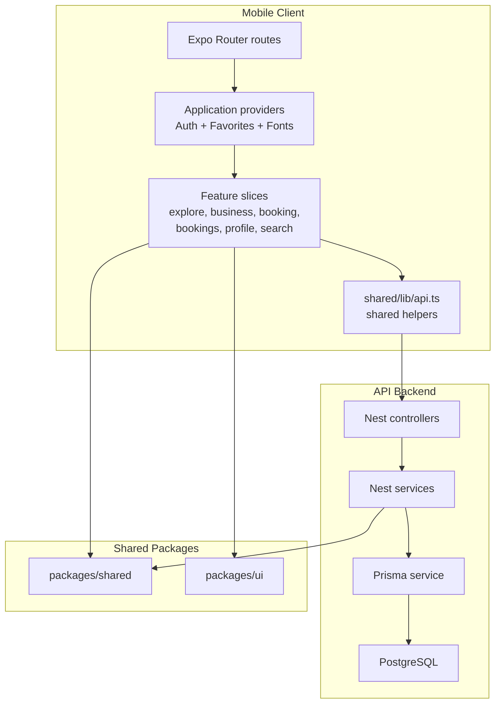

# Architecture Analysis

## Architectural Classification

This system is best described as:

- a `modular monolith` on the backend
- a `feature-sliced mobile client` on the frontend
- a `layered monorepo` at the workspace level

It is not a microservice system. There is one deployable backend service and one deployable mobile client sharing a monorepo.

## Conceptual Architecture

## Boundary Analysis

### Frontend

The intended frontend shape is good on paper:

- routes in `apps/mobile/app`
- global setup in `src/application`
- feature-first code in `src/features`
- reusable infrastructure in `src/shared`

That separation is visible in files like:

- `apps/mobile/src/application/providers/AppProviders.tsx`
- `apps/mobile/src/application/providers/auth/AuthContext.tsx`
- `apps/mobile/src/features/business/pages/BusinessDetailScreen.tsx`
- `apps/mobile/src/features/booking/pages/BookingScreen.tsx`
- `apps/mobile/src/shared/lib/api.ts`

But the mobile architecture is weakened by duplicate user flows:

- `apps/mobile/app/booking.tsx` points to `src/features/search/pages/BookingScreen.tsx`
- `apps/mobile/app/(tabs)/booking.tsx` points to `src/features/booking/pages/BookingScreen.tsx`
- `apps/mobile/app/profile.tsx` points to `src/features/search/pages/ProfileScreen.tsx`
- `apps/mobile/app/(tabs)/profile.tsx` points to `src/features/profile/pages/ProfileScreen.tsx`

This means the route layer currently exposes two competing implementations of similar product behavior.

### Backend

The backend uses standard Nest layering:

- controllers receive requests
- services implement domain logic
- Prisma handles persistence

The module map in `apps/api/src/app.module.ts` is coherent and follows clear domain boundaries:

- auth
- users
- businesses
- services
- availability
- appointments

This is a good modular-monolith baseline. The weakness is that authorization and invariants are not consistently enforced at the service boundary, so logical module separation does not yet imply safe business isolation.

## Dependency Direction

### Good Directionality

- mobile depends on `@planity/shared` and `@planity/ui`, not the reverse
- api depends on `@planity/shared`, not on mobile
- backend controllers depend inward on services
- design tokens/components are extracted to `packages/ui`

### Problematic Directionality

- product intent often flows from stale docs rather than code truth, causing drift
- the search feature has become a parallel subsystem instead of a thin slice that can be retired cleanly
- mobile screens sometimes assume response shapes that are not normalized from backend DTOs, which creates implicit coupling

Example:

- `apps/mobile/src/features/business/pages/BusinessDetailScreen.tsx` expects `locations[0].address`
- backend `Location` records expose `address1`, `city`, `postalCode`, and `country` in Prisma-backed responses

That is not a hard compile-time contract; it is a runtime guess.

## Separation Of Concerns

## What is done well

- Shared domain enums and helpers are centralized in `packages/shared`.
- UI tokens/components are centralized in `packages/ui`.
- Backend modules align with domain concepts rather than transport-only folders.
- Mobile global concerns are mostly isolated in providers and `shared/lib`.

## Where concerns are blurred

- The search feature mixes UI, mock datasets, future roadmap behavior, and placeholder service calls in one slice.
- The booking domain exists twice in mobile code: once as a real flow and once as a mock prototype flow.
- Favorites are implemented as client-only persistence in a global provider, but the product semantics imply account-level state.
- Docs and code disagree often enough that onboarding requires manual reconciliation.

## Coupling Assessment

### Tight Coupling Risks

- `apps/mobile/src/features/booking/pages/BookingScreen.tsx` fetches business data and then derives service-variant data client-side from the same response. That makes the mobile screen tightly coupled to the exact nested backend payload.
- `apps/api/src/appointments/appointments.service.ts` mixes idempotency, availability conflict checks, entity lookup, duration calculation, authorization assumptions, and write logic in one service method.
- `apps/api/src/availability/availability.service.ts` couples scheduling logic to raw database queries and in-memory interval math with no caching or independent domain abstraction.

### Looser Areas

- Shared enums/constants reduce string duplication across the codebase.
- `packages/ui` prevents repeated ad hoc styling primitives.

## Scalability Constraints

### Backend

- `apps/api/src/businesses/businesses.service.ts` uses unpaginated `findMany()` with included locations and counts.
- `apps/api/src/availability/availability.service.ts` loads rules, time-offs, and existing appointments on every request, then computes slots in memory.
- booking overlap prevention is app-layer only; the schema comments admit the real database-level exclusion rule is not in place.
- root docs advertise Redis/BullMQ, but active runtime code does not actually use a queue or cache layer.

### Frontend

- the coexistence of mock and live flows increases routing, testing, and product-support complexity
- mobile state is still mostly local component state, which is fine now but makes cross-flow consistency harder as features expand

## Maintainability Risks

### High Risk

- duplicate route surfaces for booking/profile
- stale docs claiming features or files that do not exist
- weak API typing at boundaries via `any`
- backend business rules concentrated in a few service methods with limited tests

### Medium Risk

- auth, booking, and favorites use ad hoc local patterns instead of a consistent domain layer
- heavy use of inline request/response shape assumptions
- feature naming drift between `search`, `business`, and `explore`

## Architectural Strengths

- Reasonable monorepo boundaries
- Clear backend module decomposition
- Practical shared-package extraction
- Feature-first mobile organization is directionally correct
- The API-backed booking slice proves the core business loop can work end-to-end

## Architectural Weaknesses

- The repo contains both prototype architecture and production architecture at the same time.
- Docs represent a target-state platform more than the real system.
- Critical domain guarantees are implemented in service code rather than enforced in storage or policy layers.
- Authorization is scattered and incomplete, which undermines the modular backend story.

## Architectural Smells

### 1. Parallel Product Stacks

The old search flow and the newer business/booking flow overlap instead of handing off cleanly. This is the strongest smell in the mobile app.

### 2. Aspirational Architecture Drift

`README.md`, `ARCHITECTURE.md`, and `IMPLEMENTATION_SUMMARY.md` describe Redis, BullMQ, S3, GDPR workflows, admin surfaces, and `.env.example` files that are not matched by active code.

### 3. Weak Boundary Contracts

Response shapes are not normalized through explicit DTO/view-model boundaries on both sides. The result is brittle UI assumptions and easier regression.

### 4. Domain Logic Concentration

`appointments.service.ts` and `availability.service.ts` carry a lot of critical behavior. They are becoming mini-monoliths inside the monolith.

## Final Assessment

The architectural direction is good enough for an MVP:

- one mobile client
- one backend
- shared packages
- domain-oriented modules

The real issue is not wrong architecture choice. It is incomplete architectural execution.

If the current codebase keeps evolving without first deleting duplicate flows, tightening contracts, and enforcing invariants at the domain/persistence boundary, future work will become slower and riskier even before the product reaches meaningful scale.
