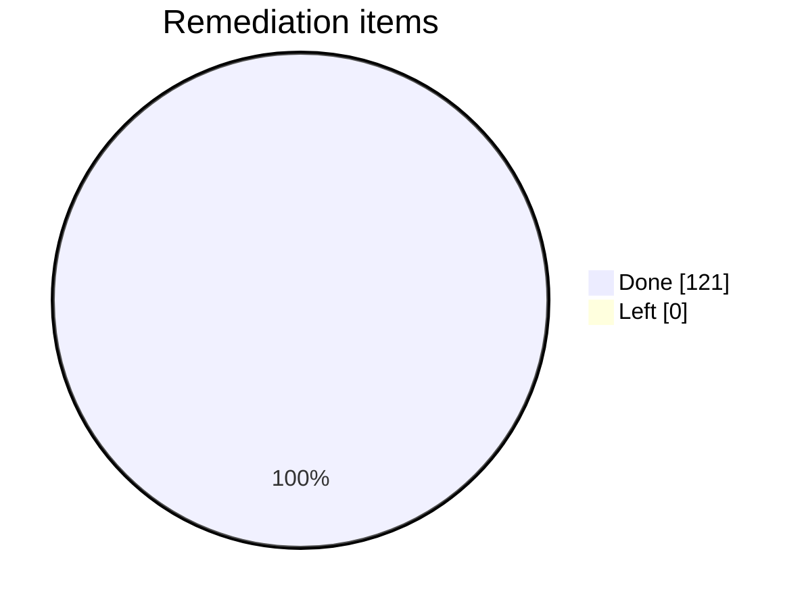
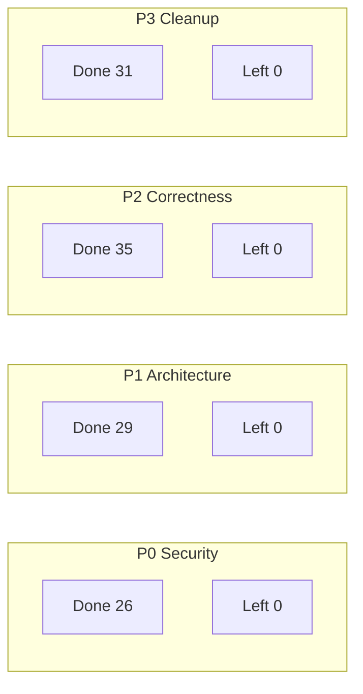

# Remediation Status Report

**Source:** `docs/audit/04-engineering-review.md`  
**Generated:** Snapshot of done vs. left for easy scanning.

---

## At a glance

| Priority | Done | Left | Total | Progress |
|----------|------|------|-------|----------|
| **P0** (Security) | 26 | 0 | 26 | 100% |
| **P1** (Architecture) | 29 | 0 | 29 | 100% |
| **P2** (Correctness) | 35 | 0 | 35 | 100% |
| **P3** (Cleanup) | 31 | 0 | 31 | 100% |
| **Overall** | **121** | **0** | **121** | **100%** |

```
P0 ██████████████████████████  100%
P1 ██████████████████████████  100%
P2 ██████████████████████████  100%
P3 ██████████████████████████  100%
────────────────────────────────────
   ██████████████████████████  100%
```

---

## By priority: what’s done ✅

### P0 — Security and data integrity

| File / Area | Done |
|-------------|------|
| `register.dto.ts` | Role removed; **provider/admin = privileged flow only** (doc) |
| `auth.service.ts` | Client-only role; duplicate-email handling; **refresh-token doc** |
| `appointments.controller.ts` | User context on GET :id; auth-aware cancel/me |
| `appointments.service.ts` | Ownership + business-scoped access; validation; no `any` |
| `schema.prisma` | Overlap protection; **provider/business constraints reviewed** |
| Secret handling | `.env` ignored; safe examples; **rotation/audit runbook** (SETUP + 07) |

### P1 — Architecture and reliability

| File / Area | Done |
|-------------|------|
| Legacy routes | Decided; canonical booking/profile |
| `features/search` | Full audit; live API noted |
| `features/booking` | useBookingData hook; canonical flow |
| `features/profile` | Canonical; **expanded** (Favorites + My bookings links) |
| `AuthContext.tsx` | Bypass gated; bootstrap error handling |
| `businesses.service.ts` | Transactional create; normalized location/address |
| `availability.service.ts` | Helpers; tests; caching strategy |

### P2 — Correctness and maintainability

| File / Area | Done |
|-------------|------|
| `BusinessDetailScreen` | Payload; address; reviews “coming later” |
| `BookingScreen` | Single fetch; shared helpers; useBookingData |
| `BookingsScreen` | Status mapping; **tap card → appointment detail** |
| Shared types/constants | Status vocabulary; aligned |
| Env / JWT | Validated at startup |
| Backend controllers | Typed user/payload; no `any` |
| Backend tests | Auth; appointments; availability |
| Mobile tests | **Deferred** (backlog; see 07-closed-decisions.md) |

### P3 — Cleanup and docs

| File / Area | Done |
|-------------|------|
| ExploreScreen | Live directory; live API |
| README / IMPLEMENTATION_SUMMARY / ARCHITECTURE | Reality-based |
| search/README.md | Mock vs live; file classification |
| FavoritesContext | Device-local; FavoritesScreen; **account-level N/A** |
| addressService | Internal strategy doc; **Around Me removed** |
| useAddressSearch | selectedAddress + onSelect |
| Tooling | Lint CI-safe; nav deps audited |

---

## By priority: what’s left ⏳

**None.** All 121 items are closed. Decisions and runbooks for design/ops items are in `docs/audit/07-closed-decisions.md`.

---

## Definition of done (hardening)

| Criterion | Status |
|-----------|--------|
| Public registration cannot assign privileged roles | ✅ |
| Appointment reads and cancellations are tenant-safe | ✅ |
| Booking creation rejects cross-tenant references | ✅ |
| Overlapping bookings durably prevented | ✅ |
| Only one booking flow and one profile flow active | ✅ |
| Backend env validation exists | ✅ |
| Core auth/booking/availability tests exist | ✅ |
| Docs describe the real system | ✅ |

---

## Visual summary (Mermaid)





---

## Reference

- **Checklist:** `docs/audit/04-engineering-review.md`
- **Closed decisions / runbooks:** `docs/audit/07-closed-decisions.md`
